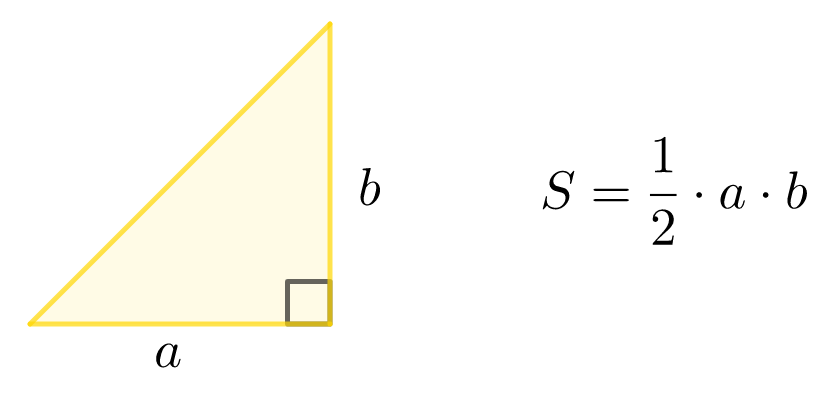

## 2.6.2. Площадь треугольника

Напишите программу, которая считывает длины двух катетов в прямоугольном треугольнике и выводит его площадь.


**Формат входных данных**
* На вход программе подаётся два **вещественных** числа ***`a`*** и ***`b`*** – длины катетов, каждое на отдельной строке.

**Формат выходных данных**
* Программа должна вывести одно число – площадь треугольника.

___
**Напишите программу. Тестируется через stdin → stdout**

**Time Limit:** 8 секунд

**Memory Limit:** 256 MB
___
**Sample Input 1:**
> **443<br />
> 390**

**Sample Output 1:**
> **86385**

<br />

**Sample Input 2:**
> **32.2<br />
> 25.5**

**Sample Output 2:**
> **410.55**

<br />

**Sample Input 3:**
> **5544.25<br />
> 6100.0**

**Sample Output 3:**
> **16909962.5**

(В третьем примере ответ может быть 1.6909962e+07, а не как у автора -- *примечание Баламут А.А.*)
___
```Go
package main

func main() {
    // put your code here
}
```