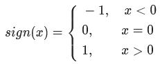

## 3.1.6. Знак числа

В математике функция sign(x)sign(x) - (знак числа) определена так:<br />


Говоря простым языком:

* Если вводимое число **меньше нуля**, то выводим **−1**;
* Если число **равно нулю**, то выводим **0**;
* Если число **больше нуля**, то выводим **1**.


**Формат входных данных**
* На вход подается одно целое число **`x`**, по модулю не превышающее **10000**. 

**Формат выходных данных**
* Для данного числа **`x`** выведите значение **sign(x)**.

<br />

**Примечания:**

1. Чтобы сравнить на равенство два значения, используйте два знака "равно" (**`==`**).
___
**Напишите программу. Тестируется через stdin → stdout**

**Time Limit:** 8 секунд

**Memory Limit:** 256 MB
___
**Sample Input 1:**
> **15**

**Sample Output 1:**
> **1**

<br />

**Sample Input 2:**
> **-5**

**Sample Output 2:**
> **-1**
___
```Go
package main

func main() {
    // put your code here
}
```