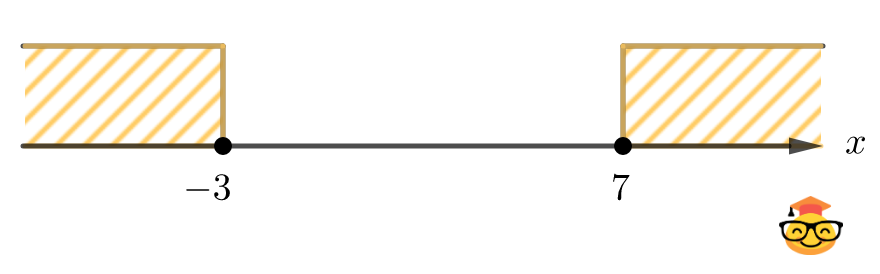

## 3.2.3. Принадлежность 2

Напишите программу, которая принимает целое число **`x`** и определяет, принадлежит ли данное число указанным промежуткам.

<br />




**Формат входных данных**
* На вход программе подаётся целое число **`x`**.

**Формат выходных данных**
* Программа должна вывести текст "**Принадлежит**" или "**Не принадлежит**" в соответствии с условием задачи.

<br />

**Примечания:**

1.  Если точка не закрашенная, то граница не включается, если точка закрашенная, то граница включается.
___
**Напишите программу. Тестируется через stdin → stdout**

**Time Limit:** 8 секунд

**Memory Limit:** 256 MB
___
**Sample Input 1:**
> **-44**

**Sample Output 1:**
> **Принадлежит**

<br />

**Sample Input 2:**
> **-3**

**Sample Output 2:**
> **Принадлежит**

<br />

**Sample Input 3:**
> **5**

**Sample Output 3:**
> **Не принадлежит**
___
```Go
package main

func main() {
    // put your code here
}
```