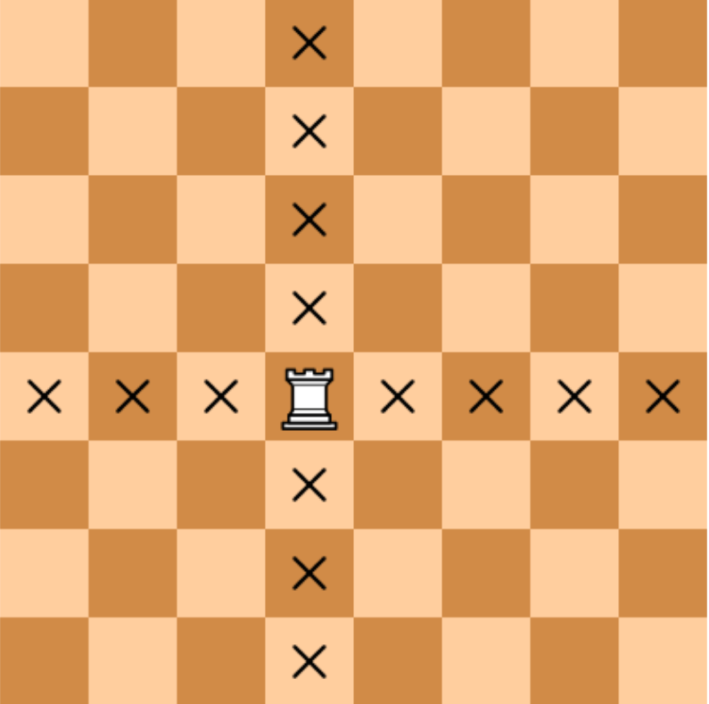

## 3.2.8. Ладья

Требуется определить, бьет ли ладья, стоящая на клетке с указанными координатами (номер строки и номер столбца), фигуру, стоящую на другой указанной клетке.

**Формат входных данных**
* Вводятся четыре числа: координаты ладьи (два числа) и координаты другой фигуры (два числа), каждое число вводится в отдельной строке. Координаты — целые числа в интервале от **1** до **8**.

**Формат выходных данных**
* Требуется вывести слово "**YES**", если ладья сможет побить фигуру **за 1 ход** и "**NO**" — в противном случае. 

<br />

**Примечания:**

1. Шахматная ладья ходит по горизонтали или вертикали: 

    </p>

2. Если вы не умеете играть в шахматы и/или для вас правила слишком сложные, то смело пропускайте задачи на шахматы. Вернетесь к ним после прохождения остальных тем. Поверьте. Это работает. 

<br />

*Подсказки внизу этой страницы.*
___
**Напишите программу. Тестируется через stdin → stdout**

**Time Limit:** 8 секунд

**Memory Limit:** 256 MB
___
**Sample Input 1:**
> **125**

**Sample Output 1:**
> **YES**

<br />

**Sample Input 2:**
> **313**

**Sample Output 2:**
> **NO**
___
```Go
package main

func main() {
    // put your code here
}
```
___

<br />

**Подсказки:**

1. Если фигура находится в той же строке или в том же столбце, то ладья бьет ее. Попробуйте это предложение перенести на координаты фигур.

2. Если (**координата 1** первой фигуры == **координате 1** второй фигуры ИЛИ **координата 2** первой фигуры == **координате 2** второй фигуры), то вывод **YES** иначе вывод **NO**.
