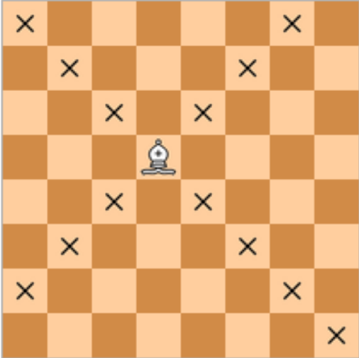

## 3.2.9. Слон

Требуется определить, бьет ли слон, стоящий на клетке с указанными координатами (номер строки и номер столбца), фигуру, стоящую на другой указанной клетке.

**Формат входных данных**
* Вводятся четыре числа: координаты слона и координаты другой фигуры. Координаты — целые числа в интервале от **1** до **8**.

**Формат выходных данных**
* Требуется вывести слово "**YES**", если слон сможет побить фигуру **за 1 ход**, в противном случае вывести слово "**NO**". 

<br />

**Примечания:**

1. Шахматный слон ходит по диагоналям: 

    </p>

2. Если вы не умеете играть в шахматы и/или для вас правила слишком сложные, то смело пропускайте задачи на шахматы. Вернетесь к ним после прохождения остальных тем. Поверьте. Это работает. 

<br />

*Подсказки внизу этой страницы.*
___
**Напишите программу. Тестируется через stdin → stdout**

**Time Limit:** 8 секунд

**Memory Limit:** 256 MB
___
**Sample Input 1:**
> **1<br />
1<br />
1<br />
2**

**Sample Output 1:**
> **YES**

<br />

**Sample Input 2:**
> **4<br />
4<br />
3<br />
3**

**Sample Output 2:**
> **NO**
___
```Go
package main

func main() {
    // put your code here
}
```
___

<br />

**Подсказки:**

1. Пусть у нас есть 4 координаты: `x1`​, `y1`​, `x2`​, `y2`​.  
Слон может ходить только по диагонали. А значит, что если `x1`​ изменяется на **1**, то и `y1`​ изменяется на **1**. То есть, на сколько позиций изменяется `x1`​, на столько позиций изменяется и `y1`​.

2. Если от координат второй фигуры отнять координаты первой фигуры, то можем узнать на сколько позиций изменились каждая из координат. В итоге имеем: `(x2​−x1​)==(y2​−y1​)`.  
На случай, если первая координата будет меньше второй добавляем вычисление модулей, чтобы не получить отрицательные значения: `math.Abs(x2−x1)==math.Abs(y2−y1)`.

3. Итого: если изменение по `Х` равно изменению по `У`, значит слон способен побить фигуру **за 1 ход**, Если не равно, то не может.
