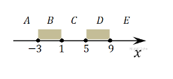

## 3.3.1. Принадлежность точки

Определите, принадлежит ли точка **`x`**  одному из выделенных отрезков **`B`** или **`D`**.



**Формат входных данных**
* Дано одно целое число `x`, по модулю не превышающее **10000**.

**Формат выходных данных**
* Выведите "**YES**", если точка принадлежит одному из выделенных отрезков **B** или **D** (**включая границы**), в противном случае - "**NO**".

<br />

*Подсказки внизу этой страницы.*
___
**Напишите программу. Тестируется через stdin → stdout**

**Time Limit:** 8 секунд

**Memory Limit:** 256 MB
___
**Sample Input 1:**
> **6**

**Sample Output 1:**
> **YES**

<br />

**Sample Input 2:**
> **3**

**Sample Output 2:**
> **NO**
___
```Go
package main

func main() {
    // put your code here
}
```
___

<br />

**Подсказки:**

1. Не забывайте учитывать границы.
